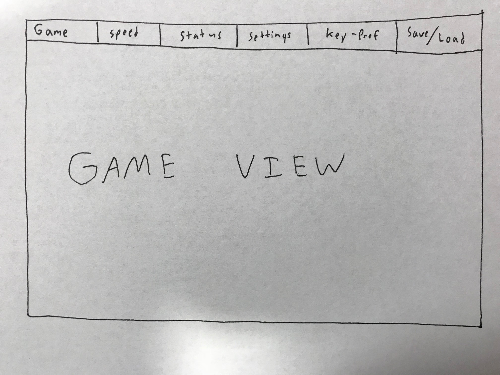

VOOGA Design Plan
===
## Introduction
We intend to build an authoring environment that allows a user to build and play scrolling-platform-style games as well as other game structures. To accomplish this, we will try make our program as flexible as possible to be able to support and create new additional features. To tackle this project, we will break the team into four separate subtasks: Game Engine, Game Authoring Environment, Game Player, and Game Data. The GAE will be able to take or create new DataObjects that represent how the game will be executed and run. It will allow the user to create and modify these values to shape the overall game experience. Game Engine will take in a variety of DataObjects and convert them into a usable model, which will be able to run the various user created games. The Game Player will be able to take in DataObjects and models from the Game Engine and create the visual display of the game and will also be able to modify DataObjects as the user progresses in the game. Positions and movements of objects will be updated and displayed by Game Player. Game Data will be used to save all variables and attributes that each game needs, including inter-object interactions. It will serialize the data to be saved into a file and will deserialize data into modifiable objects.

These four components allow us to extend features and create new components without modifying the behaviors of the other components. In general, our components will be closed but will use sub-classes to allow for future integration of extra features.

#### Flexibility

Our project will be most flexible in the Game Engine and Authoring Environment areas. Here, future game maintainers will be able to add new components and menus to enhance entity and level capabilities.

#### Open & Closed

Game Data is open. Graphical Authoring Environment and Game Player are closed to each other and linked through Game Data. Game Engine at its core is closed, but will be open to extension through its component classes.

#### Considerations for our genre

* Single player vs Multiplayer
* Environment design/Map or level building
* Fizix
    - Some other game genres, like turn-based-strategy games or some forms of RPGs, won't have to deal with designing physics engines. Our platform scrollers, however, will need to allow the user to design different physics systems (i.e. gravity, reversed-gravity, different conditions for thrown objects, etc.).
- Progress/status
    - Our games will need to have progress trackers that display the player's progression through each level, score, etc.
* Live/dynamic display

## Overview

### Game Player

* Game Player is separate program that will load the data for a particular game and, using the game engine, allow a user to play the loaded game. 

#### Modules

1. Main: Main will call upon other classes to actually run the program.
2. ViewManager: ViewManager will handle creating a stage for the game, constantly keep track of all games and scenes,      handle leveling up, and handles updating the screen.
3. Menu: Menu consists of an HBox with different buttons that give different options for the player such as replay, switching games, and game selection.
4. Data Manager: Data Manager keeps the current state of the game and is updated in ViewManager. An instance of DataManager will be passed into various player option classes so that it can be updated within those classes
5. Button Maker: Button Maker will make buttons to be used in the Menu module
6. PullDown Factory: PullDown Factory is a factory for a pull down menu for various options that will be used in the HBox menu
7. Initializer: Initializer takes data from the authoring environment and visualizes it in an ideal way for the Game 
   Player.
8. ImportData Interface: This interface allows for information from the saved data files to be read into the DataManager class. This interface also involves pulling in initial game information from Game Authoring Environment.
9. ExportData Interface: This interface allows information from DataManager to be exported to save preferences and save the current game state.
10. MenuData Interface: This interface represents the connection between the DataManager and Menu Classes so that DataManager will always contain the most updated menu data. Additionally, this will populate the Menu with the correct settings during initialization.
11. ViewData Interface: This interface represents the connection between the DataManager and ViewManager Classes so that DataManager will always contain the most updated HUD data. 
12. PlayerView: This is responsible for controlling animation and updating animations for the game.


### Game Engine
Overview: our game engine extensively employs ECS (Entity-Component-System). This
#### Modules
1. Entity: 
2. Component: Components are passive data structures, tightly coupled with Systems (e.g. CollidableComponent is very tied to CollisionSystem) Instantiation/editing of Components is made possible for Game Authoring through a ComponentFactory
3. GameSystem:
4. Level: Container of entities...
5. Engine: This is our public interface with Game Player. It contains a collection of Systems that describe game behavior, as well as exposes several filter functions that provide Game Player the relevant subset of Entities that need to be displayed to the screen 
    * Defines the level that gameplay will be occurring in: contains the entities and events pertinent for each level of the game; is essentially a collection of a subset of the game's entities and events


### Game Authoring Environment

#### Modules
 
1. Entity Creator: This module will include a visual display of available entities to be created, as well as a system for the user to enter values of Entity data (such as location, sprite, etc). This module will be responsible for adding the created Entity to the c. The Creator class will include methods to create entities (taking in various parameters) and to display those entities on the Canvas.  
2. Event Creator: This module will provide a visual display to tie together multiple Entities using Events. The user will be able to choose which Events to create and which Entities are involved in that event. This could be viewed as a kind of EventFactory, but with visual elements to allow the user to input necessary information. 
3. Level Preferences: This object will provide a visual way to create and edit different levels, tying all of the entities, events, and preferences created together within that object. 
4. Storyboard: This module will allow the user to view, select, and reorder all available levels.
5. Canvas: This module will be responsible for displaying all created entities, as well as the background and other overarching elements.

### Game Data

#### Modules

1. SaveData: This module will provide a method to save the state and relationship between every object in the game, whether inside the game authoring (saving a a "blank" copy of the game) or inside the game itself (saving an "instance" or player's account of the game). This is entirely encapsulated within the back end, so the user's only interaction with this feature is to click "save as". SaveData encompasses the entire game, including settings, interactions between objects, objects themselves, game metadata, etc.)
2. LoadData: This module will provide a method to load the saved state of the game, as well as all the accompanying relationships, metadata, objects, and settings. For understanding, as of right now the "blank" copy of the game is a copy of the game that has only default values for every object, to be defined by the gamer. The Game Authoring Environment should ideally load only the "blank" copy for editing, because saving a game in the Game Authoring Environment saves the game as an entirely "new" game, i.e. the relationships and states saved by the GAE become the defaults loaded by the game player later on. This is also entirely in the back end, so the user's only interaction with this feature is to click "load game", which loads everything saved previously. 
3. SerializeData: This class is called by SaveData, and it includes the fucntionality to serialize whatever is passed to it. In essence, some object is passed to this class, and this class passes back a serialized version of it, to be manipulated/stored by the SaveData class. This is entirely encapsulated, meaning that the user never interacts with this directly. 
4. DeserializeData: This class is called by LoadData, and it will essentially do the reverse of SerializeData. It will unpack all the objects and data/states/relationships attributed to each object and give it to LoadData. LoadData will then call the Instantiator class.
5. InstantiatorClass: This class will reinstatiate all the data objects after DeserializeData is executed. 
6. AbstractData: All data objects will extend this AbstractDataClass, which will also extend serializable. This way, all data objects will be serializable and also the InstatiatorClass would be able to instatiate all data objects.

## User Interface

### Game Player

The screen will be divided into two sections. The top section will be an HBox with Menu options, and the bottom will be the View. We intend to make a UI in which the player can use a mouse to interact with the various drop down menus available on top of the screen. These will contain the abilities to switch games, change game status, set preferences, and work with saved data. 

The User will be able to choose which keys on the keyboard will correlate with inputs for the game to be able to play the game in whichever way it is designed. Every input will be able to be changed to fit the user's preference, in a way which is flexible to handle any possible game with any number of possible inputs.

There are three ComboBoxes that allow the user to change Speed, Status, and Save/Load options. The speed changes the rate at which the game updates, while the status allows the user to play and pause the game.

There are three Buttons for Game Selection, Settings, and Key Preferences. The latter two buttons launch two small stages with options. The stages for each of these allow the user to customize settings which are general across all games, allowing for ease of use. This includes volume and brightness.

In regards to erroneous situations (bad user input) we will display a descriptive message. For instance, if a player assigns two keys to a single input, the screen will say "You can only assign one key to one input". If a player tries to load an invalid file that is not a game file, the screen will display "This is an invalid file".



### Game Authoring Environment

We intend to build an authoring environment visually based off our included prototype (/doc/VOOGA Prototype.mp4). In the center of our screen, we have a canvas, on which a user can view the currently selected level backdrop; drag-and-drop sprites; and identify sprite-specific interactions.  

At the sides of our screen, we plan to include menus that allow for more complicated game customization. Within these menus, a user will be able to see information about the game physics, the sprites active in the level, relationships between game objects, and the level goals. If a user wishes to modify any of this information, they will have the ability to -- when selected, a menu item in the left toolbar will cue its corresponding panel to appear in the panel at the right side of the screen. Each panel will contain options specific to its category. The intended menus and their functions are:  
* Entity Creator
    * Select sprite image
    * Manage sprite sizing
    * Add intrinsic sprite behavior (ability to run, jump, etc.) 
    * Manage individual sprite interactions with the environment (e.g. will other entities be able to pass through it, etc)
    * Add sprite onto canvas
* Actions and Events
    * View all current in-game sprites
    * Manage interactions between two or more sprites (build events, link sprites with these events)
* Level Preferences
    * Select background
    * Determine win condition
    * Add music
* Storyboard
    * View and reorder all created levels
    * Adjust game settings (e.g. name of game, etc)


### Game Data

We intend to encapsulate all game data interactions within the backend, with very little to no interaction with the author/gamer. The only interations that will exist are a front-end button in both Game Authoring and Game Player ("save/load") that would call and pass all the data to the DataSaver/Loader, and the rest is handled internally  

## Design Details
### Game Player

1. Keep track of games' high scores through successive runs of the program until the user clears it
Game Player will take the highest marked score from the Game-Authoring Environment and display in the top right-hand corner. At the end of the game, the player's score will be compared with the high score, and if the player score is greater than the highest score, the highest score will be updated to reflect the player score.

2. HUD
The ViewManager will be primarily responsible for this. It will take the desired status data by the specifications set by the Game Authoring Environment and display them in the bottom corners of the screen so it can be viewed by the player

3. Replay Game
This would be achieved by accessing the Menu HBox at the top of the screen, where the player can hit a button labeled Restart that will restart the game. This feature would rely on the ButtonMaker, Menu, and Initializer 

4. Switch Game
This would be achieved by accessing the Game tab on the Menu HBox which will be a drop down menu with a name, image, and description for each game that the player can select by clicking. This feature would use the ButtonMaker, PullDownFactory, Menu, and Data Manager. Initializer would initialize the specific data so that it can be pulled up 

5. Game Selection
This would be achieved by accessing the Game tab on the Menu HBox which will be a drop down menu with a name, image, and description for each game that the player can select by clicking. This feature would rely on the ButtonMaker, PullDownFactory, and Initializer.

6. Key Preferences
A Key will be mapped to an input and saved in GameData as a new preference.

7. Save Progress
Data Manager will save the current state of the game to the file.

8. MenuData Interface

```java
/** 
 *	This interface represents the connection between the DataManager and Menu Classes so that DataManager will always contain the most updated menu data.
 *	Additionally, this will populate the Menu with the correct settings during initialization
 */

public interface MenuData{

public void updateMenuData(); // this will update DataManager so that it contains most updated menu data

public void populateMenu(); //populates Menu with correct settings during initialization
```

* The MenuData interface represents the connection between DataManager and Menu Classes so that DataManager can always contain the most updated menu data. The menu will have many options such as replay, switch games, save/load, etc.

9. GameData Interface

```java
/**
 *	This interface represents the connection between the DataManager and ViewManager Classes so that DataManager will always contain the most updated    
 *	HUD data. 
 */

public interface ViewData{

public void updateViewData(); //this will update DataManager as ViewManager updates

public void setHUD(); //this will set HUD to correct settings

```
* This interface will represent the connection between DataManager and ViewManager Classes so that DataManager can always contain the most updated HUD Data.

10. ExportData Interface

```java
/**
 *	This interface allows information from DataManager to be exported to save preferences and save the current game state.
 */

public interface ExportData{

public void exportCurrentState(); //exports current game state

public void exportPreferences(); //exports saved preferences
```

* The ExportData interface allows information from DataManager to be exported to save preferences and save the current game state.

11. ImportData Interface

```java
/**
 *	This interface allows for information from the saved data files to be read into the DataManager class. 
 *	This interface also involves pulling in initial game information from Game Authoring Environment
 */

public interface ImportData{

public void importGame(); // imports an entire game 

public void importPreferences(); // imports saved preferences for a game

public void importGameState(); //imports saved Game State 
```
* This ImportData Interface allows for information from the saved data files to be read into the DataManager class and involves pulling in initial game information from Game Authoring Environment.


### Game Engine
1. Entity: 
The Entity represents any visible (or invisible), interactive game element in a levl. The Entity module heavily employs composition (over inheritance) as to maximize backwards compatibility, and to minimize massive refactoring in the front-end modules when engine adds new features. The Entity will contain passive attributes in an instance of the Attribute class. This will be an abstraction of a map that includes fields such as, X position, Y position, sprite image, etc. It will also contain a collection of instances of the Behavior class. This collection describes the available actions (essentially Events) available to be activated in the Entity. The below interface describes the interface that Authoring can interact with to allow the user to construct and edit these two key fields of an Entity. (a similar, but read-only interface may be implemented for Player to interface with)
```java=
public interface Entity(){
    /**
    * activates a behavior on the entity based on the behavior's ID
    */
    void activate(String ID);
    
    /**
    *Adds a behavior to the entity
    */
    void addBehavior(Behavior behavior);
    
     /**
    * Removes a behavior
    */
    void removeBehavior(Behavior behavior);
    
     /**
    * Adds an attribute to the entity
    */
    void addAttribute(Attribute attr);
    
     /**
    * Removes an attribute
    */
    void removeAttribute(Attribute attr);
}
```
2. Behavior: 
The Behavior module should be able to define its own behave method, which specifies what action it chooses
to perform based on the implementation. A behavior does not have direct access to a specific entity, but it is given access to a map of key value pairs (passed as a parameter in behave) that contain state data of a given entity. This allows a given Behavior component to be able to change the position of an Entity, for instance. This data map will be passed to the behavior from the specific entity. Several simple behaviors should be predefined by the GameEngine (such as our set implementations of Move, Disappear, etc.) but multiple different types of behaviors could technically be implemented by calling a specific chain of these simple behaviors on an entity. This should be discussed with Game Authoring. The API for a given behavior is shown below:

```java=
public interface Behavior{
    /**
    * Executes the specific action/result of the behavior 
    */
    void behave(Map<String,Behavior>() attrMap);
}
```
This API will be called from within the Entity module, making this more of an internal API. We decided to have Behavior as a module because it allows us to predefine very general actions that can be reused.
3. Attribute: 
The Attribute class will allow us to hold key-value pairs of an Entity’s attributes, such as “xPos: 50”, “yPos: 40”, so on and so forth. It allows us to encapsulate the logic and data type that a given attribute might possess. Some collection of Attributes will be held inside Entity and represent that Entity’s point-in-time state. The Attributes will be passed to given Behaviors that then operate on those Attributes to modify the Entity’s state. We believe that using the Attribute class will add more flexibility to our design, and extending it would just mean adding a class that implements the interface.

```java=
public interface Attribute{
    //**
    *
    /
    void setValue(String val);
    //**
    *
    /
    void setKey(String key);
    //**
    *
    /
    void getValue();
    //**
    *
    /
    void getKey();
}
```
4. Event: 
To put it simply, an Event is anything that can *happen* in a game. This interface will have the most submodules/complex class hierarchy as it needs to essentially describe anythign that a user can imagine will happen in a game. Every event has two univeral behaviors: what changes in the game when the Event is triggered, and any other events that will be triggered when this Event happens. Behaviors will likely be a submodule of Event. Events will likely be divided into events that happen to entities (collision, death, movement, and other attribute changes), levels(level progression, level changes, level start/end), and inter-event interactions (anonymous boolean functions/decision trees, timers/looping, delays)

```java=
    public interface Event{
        void do();
        void addEvent();
        void removeEvent();
    }
    
```
5. Physics: Using a library
We plan to use an outside library for the majority of our physics calculations, as we believe it will make our application less laggy. It also won’t take away from our overall design, as we’d essentially just be using the library for calculation and functionality purposes. Since it’s a library, you can’t really extend it in any way. We’d be dependent on the functionality in that library and have to rely on the API that library exposed being useful.
7. WorldView: 
```java=
    public interface WorldView{
        void getLevelPosition();
        Level getLevel();
    }
```
7. Level:
A Level is a data structure that can be written to and read by the Game Authoring as well as the Game Player. Through the Level interface, the Game Authoring should be able to add and remove entities in the given Level. The Game Player should be able to read from these entities from the Level. The general functionality for the Level module is shown below:
```java=
    public interface Level{
        Collection<Entity> getEntities();
        Collection<Entity> getEvents();
        void addEntity(Entity ent);
        void removeEntity(Entity ent);
    }
```
The interface that Game Authoring would be able to use is defined here:
```java=
public interface WritableLevel{
        void addEntity(Entity ent);
        void removeEntity(Entity ent);
    }
```
The interface that Game Player would be able to use is defined here:
```java=
public interface ReadableLevel{
        Collection<Entity> getEntities();
        Collection<Entity> getEvents();
    }
```
We decided to have Level as its own module because it allows us to define a data structure that has a set of general interfaces that Game Authoring and Game Player can rely on to write and read from.
### Game-Authoring Environment


### Entity Creator

The Entity creator will be the utility that allows the user to place game elements and to set up graphics for those elements. It will work closely with the engine Entity class because it will be creating objects of that class, and with the Level class because each Entity created will be assigned to a level. The class will need to use a large number of JavaFX user input functions, such as drop-down menus, tab-panes, text-input fields, buttons, etc. The Entity Creator will need to be able to pass its created entities to the EditWindow, where they will be displayed for the user. 

This module will utilize Entity classes from the Game Engine interface, and thus won't need a public API.


### Event Creator

The Event Creator will consist of the GUI elements that allow a user to create an Event and specify which Entities that it should apply to. This will need to make use of many JavaFX elements to allow the user to select different options, such as ComboBoxes, TextFields, etc. It will also require the use of some other classes, like helpers for getting user inputs and assigning them to new instances of Events.

This is a necessary module because we need to have a way for the user to be able to create game objects via their own input, rather than programmatically. 

There will be no public interface for this module because it will be contained within our front-end entirely. It will simply call the Game Engine's interfaces to create these events and represent them visuall or otherwise.  

### Level Preferences

The Level Preferences pane will allow the user to create engine Level objects and add specifications to that level such as background image, music, and a win condition. After the level is created, created entities will be part of that level until a new level is created or selected. The Level Preferences pane will not need to be public because we want it to be closed to extension, representing the static preferences that a user selects for the game they design. 


### Storyboard 

The Storyboard will provide a visual way for users to organize collections of Entities and Events into Levels, and arrange those levels in order based on their ending events. The Storyboard will also give the user the ability to select and already created level for edit. 

This module is necessary in order for the user to have a way to create an ordering of levels like it says in the assignment specification. 

This module should not be extensible, but it should be able to interact with any Level.


### Canvas

The Canvas will be the central part of our GUI that displays what a current level looks like. It will accomplish the goal of letting users see their game-creation process and allowing them to interact with the game Entities and Events. 

To do this, it implement the GUINode Interface, which will define what any kind of displayable GUI object must have and do. This will include functionality to export itself as a JavaFX node and return information about inself. This Interface will collaborate with a class called GUIBuilder, which will take in information about the GUIComponent to be built and create new instances of the required component.  

This is a necessary module because we need a way for the user to see their changes to a game in real-time, with all created Entities visible. 

This class should not need to be extended - it merely displays whichever level is currently selected. This class itself does not create any back end objects or store them anywhere. 

### Controllers 

The Authoring Environment will have a number of controllers that allow the different panes the communicate with each other. For example, there will be an EntityController class that allows the EntityCreator to place objects on the Canvas. This class will also allow the Canvas to communicate with the EntityCreator so that the EntityCreator knows which Entity to edit.

There will also be a LevelController that creates back end level objects and communicates with the EntityCreator to add Entities to the current Level. The LevelController holds all the Levels, and will therefore also communicate with Storyboard to handle reordering. The LevelController also communicates with data in order to save levels.

There will also be a general PaneController which will communicate between any other necessary panes. For example, the save data button is in the left menu, so the Pane controller will be able to communicate with LevelController to give this butotn functionality.

### Game Data

1. Interface for LoadData/SaveData

The interface will be used to make the LoadData and SaveData classes succinct and readable. This interface is useful because, while not necessarily necessary, it can help with flexibility if any of the other classes in our project need to interact through a general channel with the data, and especially if new generic methods need to be added for general refernce. 

*NOTE: Need to discuss parseData, for example for "save" it's passed in parameter will be a group (probably), but for "load" it'll be a file.*

```java=
public interface DataManipulation{
    public void parseData(DataObject do);
}
```
2. SaveData

The SaveData class contains the methods that will build the file(s) that represents all of the game data. Within the presented methods are going to be references to methods contained in other subclasses that will serialize our data. Within the parseData, for example, data will be serialized and within saveToFile, the serialized data will be formatted (if necessary) and saved. One potential way of organizing this is to use different save folders based on the data being serialized, a folder to save "characters", "environmental objects", "AI", etc and their states. 

```java=
public SaveData implements DataManipulation{
    public void parseData(DataObject do);
    //parseData will call Serialize
    public void saveToFile();
}
```

3. LoadData

The LoadData class contains the methods that will open a saved file or folder containing all the current game data. Each of the methods calls other subclasses and their methods that will deserialize and instantiate the inputted data. Within parseData, for example, the inputted data will be passed to another class to turn it into the original objects, and the Instantiate method will, as the name implies, instantiate these objects so that the game engine can interpret, edit, and manipulate them. Because different objects/entities might be saved in different folders, LoadData must be smart in when it searches which folder, and when it passes objects back to the engine and how it does so. 

```java=
public LoadData implements DataManipulation{
    public void parseData(DataObject do);
    //parseData will call DeserializeData
    public void instantiate();
    //instantiate will call the Instantiator
}
```

4. SerializeData

The SerializeData class will primarily be in charge of serializing an object and that object's properties/attributes/relationships with other objects. Because all the data must extend "AbstractData", which implements serializable, any nested objects can also be serialized. It returns a serialized object for the rest of the Game Data to manipulate and handle. 

```java=
public SerializeData{
    public serialize(DataObject do);
    //complete serialize will occur here
}
```

5. DeserializeData

Does essentially the opposide of SerializeData. Will take in a serialized object and convert it back into the entity that it originally was, and pass that to the instantiator, which creates that object. 

```java=
public DeserializeData{
    public deserialize(DataObject do);
    //complete deserialize will occur here
}
```

6. Instantiator

This class will be responsible for taking in the deserialized data and instantiating an object to pass back to the LoadData for manipulation and ultimately passing to either Game Authoring or Game Engine.

```java=
public Instantiatior{
    public DataObject createObject(Object values);
    //the data object will be created in here with the values and attributes that the deserialize receives.
}
```

7. AbstractData

Forms the class that all data must extend; this is so that all of the other classes can convert data easily and without any depencies on the individual data types themselves. 

```java=
public abstract DataObject extends Serializable{
    //data objects and values necessary to be stored
}
```

## Example Games
1. Junk Jack: Junk Jack is a game which can be most easily described as a 2D version of Minecraft. The player walks back and forth through a world made of square blocks, with the ability to create and/or destroy blocks. The objective of the game is to explore the world to find the rarest materials, and to craft the most impressive fort to live in. Our authoring environment will be able to handle the creation of the stage through uploading the desired images for the different blocks, which will be converted into entities that can be placed on the stage. These entities will then have all of the desired block properties tied to them through the editor. The player and the actions tied to the player will be cast to different buttons on the keyboard through options available in the Event creator. Additionally, the blocks will have different actions tied to different events as well. For instance, if the player hits the block, it would trigger the action of the destruction of the block. The event of the player clicking a location of the screen while holding a block would trigger the action of placing that block at the new location. With these few steps our environment would be able to create the basics of the game.
2. Super Mario Bros. is the classic example of a scrolling platformer. In this game, the user attempts to get through a level, maximizing their score and the number of coins they collect. The world is built mostly of blocks, with some fancy features like pipes that provide teleportation-style movement. There are also enemies that can be destroyed in a variety of ways, like by jumping on top of them or using a special powerup. Our authoring environment will allow each of the blocks to be placed as stationary entities. The user will be able to give certain blocks specific powers by adding events to them — an event, in our lingo, is when an action such as a collision triggers another action. In this case, having the sprite collide with the block would release a coin or powerup from the block, which the user would be able to set in the game authoring environment. Killing enemies would be similar — collisions could be detected between projectiles and the enemies or the user’s sprite and the enemy. Lastly, reaching the end of the level (by entering through a portal, reaching a flag, etc.), would be a collision between the user’s sprite and that portal or the user’s sprite and the flag, and would trigger progression to a new level.
3. Celeste: Celeste is an indie platformer, with the defining elements of vertical level progression, simple but highly-extensible movement, rapidly scaling difficulty and distinctive art/sound direction. Movement of the avatar, Celeste, is controlled with left and right arrow keys for left and right movement, C for jumping, and X for a double jump/directional dash. The game objective is to ascend to the "summit" of an icy mountain, with each level being a 100m increase in elevation. Surfaces are oft covered with spikes that kill Celeste on contact, so the fundamental game loop is navigating mountain passes with strategic leaping and wall jumping as to avoid touching spiked areas. These fundamental game elements will be suported by our design. Level design with a grid of blocks is possible with our authoring environment allowing for drag and drop placement of entities, as well as our engine allowing customizeable events to occur between customizeable entities. (for instance, a collision event between celeste and a spike block will trigger a death/respawn event) Movement is made possible with using key input events as triggers for moving an entity representing Celeste, and timed booleans for events allow for precise windows for timing leaps and jumps to navigate mountain passes.
4. Cuphead: Cuphead is defined by its distinctive animation/art style, and extreme mechanical difficulty. Cuphead is a bullet-hell/2d shooter/2d platformer. In terms of movement mechanics, it is essentially the same as in Mario, with jumping and 2d movement, but where Cuphead can use a different aspect of our engine is in boss enemy construction. In order to simulate animation and different hit values of different body parts of a boss, a boss can be constructed of several separate entities, each with their own hitboxes, powerups, hit values, etc. Using this model, each body part of a boss can have independent movement/animation, and the boss can appear to be destroyed in parts (say, amputating an arm). Our authoring environment and engine will fully support this functionality, as events involving one entity can be linked to events in other entities. For instance, one "brain" or "controller" entity could dictate side by side movement for the entirety of the boss's body, and all of the other constituent body parts can be controlled by movement events that are tirggered by movement of this "brain" entity.

## Design Considerations

### Game Player

* Before we can devise a complete design solution, we need to further hash out how we are to receive and parse data from the back-end.
* With regards to our current design, we as of now are thinking of creating a DataManager class that will constantly update and monitor the data for each user preference so that we can always access the most updated information. The current state of the game being played will also be monitored constantly.
* For the advanced sprint, we need to figure out how to implement infinite scrolling with our Camera.

### Graphical Authoring Environment

* We spent a lot of time discussing what our class hierarchy should be for the authoring environment. Because everyone in our subteam has worked on front end before, and hasn't been entirely satisfied with how classes were organized, we plan to have a GUIBuilder abstract super class and GUINode interface to standardize and separate classes that create different panes and set up the organization of the GUI overall
* We also wanted to make our ComponentMenus easily extendable, so that as engine adds new entity components, those can easily be displayed in the Authoring Environment. In other words, we want to avoid creating an entire new class for every component menu every time a new component is added. Therefore, we have a ComponentMenuFactory and general ComponentMenu class to be able to create a variable number of ComponentMenus easily.
* We intend to keep most of our methods private or package-friendly and have the only public methods be those that are needed by game data

### Game Engine
* How to make the code compatible with the internal Physics Libraries
* We assumed the all attributes are primitive values that can be parsed/converted from and to String
* A design decision we made regarding the activation of behaviors was to include the activate() method at the Entity level (rather than the Behavior level) and have a handler class to run multiple activate() functions at once (such as run and jump simultaneously).
* Authoring and Player heavily interact with our fundamental interfaces (Event & Entity), so any modifications must be very deliberate, and with backwards-compatibility in mind
* Major ambiguity: Game settings and preferences are still somewhat nebulous in our game definition -> once core model modules and Event and Entity are more worked out, settings and preferences will be more tangible

### Game Data
* We discussed making very large, overarching data types for every class to implement for ease of reference, especially with generic references. For example, an important step taken is to create the AbstractData class, which enables our methods to internally edit and serialize any class as long as it extends AbstractData, and, by that token, implements serializable. 
* Significant time went into discussing the relationship between the differnet subclasses, and we determined that the best result is to separate each "function" as much as possible. To that end, the "SaveData" and "LoadData" classes will be relatively short and mostly perform data management rather than data manipulation. Instead, each subclass will be responsible for internally manipulating the data in the way requested by the Save/LoadData classes. 
* A design consideration and decision was made to potentially separate different serialized data into different folders. For example, character models will be saved into one folder and loaded from that folder. Environmental objects, rules, interactions, and other data will also be saved into their respective folders. This way, the Game Engine has an easier time knowing what it is getting from Game Data and the data is better organized and managed. This may require multiple and specific writes within the Save/LoadData classes, and should they prove to be too difficult/a better implementation is to have the entire game be a single serialized data folder, we can adjust this later on. 
* The vast majority of our methods will be internal to the data management, with the only front facing methods being the obvious one "parseData". Everything else will be handled internally, exhbiting good closed design. 

## Team Responsibilities
#### Front End
* Graphical Authoring Environment
    * Liam Pulsifer
    * Jennifer Chin
    * Elizabeth Shulman
* Game Player
    * Brandon Dalla Rosa (Also want to create an AI)
    * Dana Park

#### Back End
* Game Engine
    * Andy Nguyen
    * Ben Hubsch
    * Kevin Deng
    * Jeremy Chen
* Game Data
    * Brandon Guo
    * Harry Wang